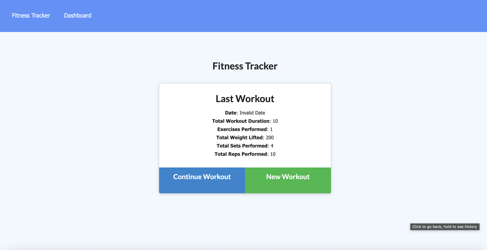

# unit17-fitness-tracker
## Deployed app
<a href="https://fit2track.herokuapp.com"> click here </a>
# Description 
Fitness tracker is a full stack application that allows users to track their workouts.  
At the homescreen, the user can see the summary of the last workout. the user also has the option of adding a new workout or adding a new exercis to their current workout.  

 

# Installation
<ul>
<li>run "npm i" to install all the needed dependencies.</li>
<li>npm run seed to seed the data based</li>
<li>connect to a established data base with collections</li>
<li>on integrated terminal run "npm start" to start the application.</li>
<li> enjoy the fruits of your hard work<li> </ul>

## Contact information 

for any clarification or questions, contact me! email: dyylancasanova17@gmail.com  
if you would like to help me make this application better, please feel free to do a pull request.
GitHub: Dylan-Casanova